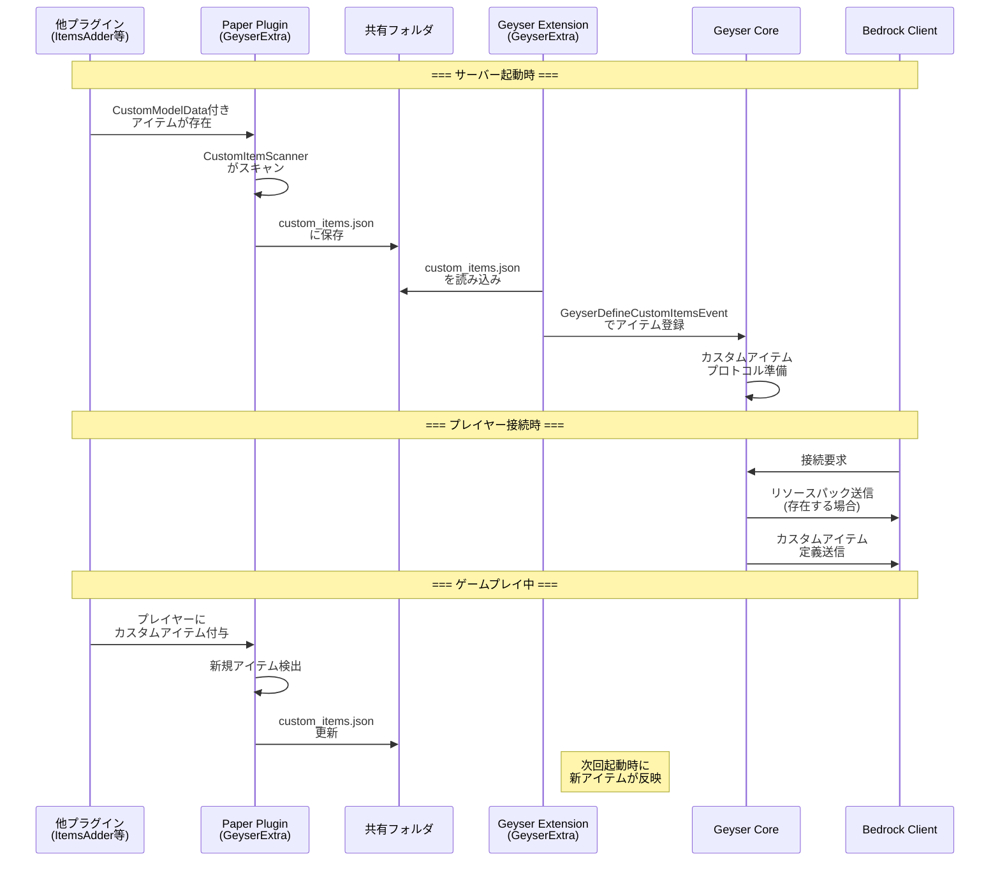

# GeyserExtra 自動マッピング機構の仕組み

このドキュメントでは、Java版で追加されたカスタムモデルやレシピが自動的にBedrock向けにマッピングされる仕組みを説明します。

---

## 1. 全体アーキテクチャ

```
┌─────────────────────────────────────────────────────────────────────────────┐
│                          Java Server (Paper 1.21.11)                        │
│                                                                             │
│  ┌─────────────────┐      ┌─────────────────┐      ┌─────────────────┐     │
│  │ 他プラグイン     │      │ Paper Plugin    │      │ Geyser Extension│     │
│  │ (ItemsAdder等)  │─────▶│ (GeyserExtra)   │─────▶│ (GeyserExtra)   │     │
│  │                 │      │                 │      │                 │     │
│  │ CustomModelData │      │ スキャン & 検出  │      │ Geyser API登録  │     │
│  │ 付きアイテム作成 │      │                 │      │                 │     │
│  └─────────────────┘      └─────────────────┘      └─────────────────┘     │
│                                    │                        │               │
│                                    ▼                        ▼               │
│                           ┌───────────────┐        ┌───────────────┐       │
│                           │ 共有フォルダ   │        │ リソースパック │       │
│                           │ custom_items  │        │ 自動生成      │       │
│                           │ .json         │        │               │       │
│                           └───────────────┘        └───────────────┘       │
└─────────────────────────────────────────────────────────────────────────────┘
                                                              │
                                                              ▼
                                                    ┌─────────────────┐
                                                    │ Bedrock Player  │
                                                    │ カスタムアイテム │
                                                    │ 表示            │
                                                    └─────────────────┘
```

---

## 2. CustomModelData 検出の仕組み

### 2.1 Java版でのCustomModelDataの役割

Java版Minecraftでは、リソースパックを使用してアイテムに**CustomModelData**を設定することで、バニラアイテムに異なる見た目を付与できます。

```json
// Java版リソースパック: assets/minecraft/models/item/diamond_sword.json
{
  "parent": "item/handheld",
  "textures": {
    "layer0": "item/diamond_sword"
  },
  "overrides": [
    { "predicate": { "custom_model_data": 1 }, "model": "custom/fire_sword" },
    { "predicate": { "custom_model_data": 2 }, "model": "custom/ice_sword" }
  ]
}
```

### 2.2 Paper Plugin側の検出プロセス

**CustomItemScanner.java** が以下のプロセスでカスタムアイテムを検出します：

```java
// Paper 1.21+ Data Component API を使用
public Optional<CustomItemMapping> scanItem(ItemStack item) {
    // 1. CustomModelData の存在確認
    if (!item.hasData(DataComponentTypes.CUSTOM_MODEL_DATA)) {
        return Optional.empty();
    }

    // 2. CustomModelData 値を取得
    CustomModelData cmd = item.getData(DataComponentTypes.CUSTOM_MODEL_DATA);

    // 3. 1.21.4+ では floats() または strings() から値を取得
    List<Float> floats = cmd.floats();
    if (!floats.isEmpty()) {
        int cmdValue = floats.get(0).intValue();
        // ...
    }

    // 4. マッピング情報を構築
    return Optional.of(new CustomItemMapping(
        generateName(item, cmdValue),
        item.getType().getKey().toString(),  // "minecraft:diamond_sword"
        cmdValue,
        isUnbreakable(item),
        getDisplayName(item),
        null  // iconPath
    ));
}
```

### 2.3 検出トリガー

カスタムアイテムは以下のタイミングで検出されます：

| イベント | 説明 |
|---------|------|
| `PlayerJoinEvent` | プレイヤー参加時にインベントリをスキャン |
| `InventoryOpenEvent` | チェスト等を開いた時にスキャン |
| `PlayerItemHeldEvent` | 手持ちアイテム変更時にスキャン |
| サーバー起動時 | 全オンラインプレイヤーの初期スキャン |

---

## 3. Geyser API への登録プロセス

### 3.1 共有フォルダを介したデータ連携

Paper Plugin と Geyser Extension は**共有フォルダ**を介してデータを連携します：

```
plugins/Geyser-Spigot/extensions/geyserextra/shared/
├── custom_items.json    # カスタムアイテム定義
└── skulls.json          # カスタムスカル定義
```

### 3.2 JSON形式

**custom_items.json** の構造：

```json
[
  {
    "name": "custom_diamond_sword_1",
    "baseItem": "minecraft:diamond_sword",
    "customModelData": 1,
    "unbreakable": false,
    "displayName": "Fire Sword",
    "iconPath": null
  },
  {
    "name": "custom_diamond_sword_2",
    "baseItem": "minecraft:diamond_sword",
    "customModelData": 2,
    "unbreakable": false,
    "displayName": "Ice Sword",
    "iconPath": null
  }
]
```

### 3.3 Geyser Extension での登録

**CustomItemsHandler.java** が `GeyserDefineCustomItemsEvent` で Geyser に登録：

```java
@Subscribe
public void onDefineCustomItems(GeyserDefineCustomItemsEvent event) {
    for (ItemMapping mapping : itemMappings) {
        // CustomItemOptions を構築
        CustomItemOptions options = CustomItemOptions.builder()
            .customModelData(mapping.customModelData())
            .unbreakable(mapping.unbreakable())
            .build();

        // CustomItemData を構築
        CustomItemData data = CustomItemData.builder()
            .name(mapping.name())
            .customItemOptions(options)
            .displayName(mapping.displayName())
            .icon(mapping.name())  // テクスチャ名
            .build();

        // Geyser に登録
        event.registerCustomItem(mapping.baseItem(), data);
    }
}
```

---

## 4. Bedrock リソースパック自動生成

### 4.1 必要なファイル構成

Bedrockでカスタムアイテムを表示するには、以下のリソースパックファイルが必要：

```
geyserextra_rp/
├── manifest.json
├── textures/
│   ├── item_texture.json       # テクスチャ定義
│   └── items/
│       ├── custom_diamond_sword_1.png
│       └── custom_diamond_sword_2.png
└── attachables/                 # 3Dモデル用（オプション）
    └── custom_diamond_sword_1.entity.json
```

### 4.2 item_texture.json の構造

```json
{
  "resource_pack_name": "GeyserExtra Custom Items",
  "texture_name": "atlas.items",
  "texture_data": {
    "custom_diamond_sword_1": {
      "textures": ["textures/items/custom_diamond_sword_1"]
    },
    "custom_diamond_sword_2": {
      "textures": ["textures/items/custom_diamond_sword_2"]
    }
  }
}
```

### 4.3 Geyser の内部処理

Geyser は登録されたカスタムアイテムに対して：

1. **Bedrock用アイテムID**を割り当て（例: `geyser_custom:custom_diamond_sword_1`）
2. **プロトコル変換**時に Java の CustomModelData を Bedrock のカスタムアイテムにマッピング
3. リソースパックが存在する場合、テクスチャを適用

---

## 5. レシピの自動マッピング

### 5.1 Geyser の標準レシピ変換

Geyser は基本的に **バニラレシピ** を自動で Bedrock 形式に変換します。

```
Java Recipe (Shaped) ──────▶ Bedrock Recipe (Shaped)
   材料: diamond x 2               材料: diamond x 2
   結果: diamond_sword             結果: diamond_sword
```

### 5.2 カスタムレシピの制限

**重要**: Bedrock Edition には以下の制限があります：

| 機能 | Java Edition | Bedrock Edition | 対応状況 |
|------|-------------|-----------------|---------|
| カスタム作業台レシピ | ✅ | ✅ | Geyser が変換 |
| カスタム金床レシピ | ✅ | ❌ | **対応不可** |
| カスタム鍛冶台レシピ | ✅ | ❌ | **対応不可** |
| カスタムかまどレシピ | ✅ | ⚠️ | 一部対応 |

### 5.3 Geyser Recipe Fix プラグイン

カスタム金床・鍛冶台レシピには、別途 **Geyser Recipe Fix** プラグインが必要：

- [Modrinth: Geyser Recipe Fix](https://modrinth.com/plugin/geyser-recipe-fix)
- Bedrock プレイヤー向けに UI ベースのレシピ対応を提供

### 5.4 レシピ登録の流れ

```
┌──────────────────┐
│ Java Plugin      │
│ (カスタムレシピ  │
│  登録)           │
└────────┬─────────┘
         │ Bukkit Recipe API
         ▼
┌──────────────────┐
│ Paper Server     │
│ レシピレジストリ │
└────────┬─────────┘
         │
         ▼
┌──────────────────┐
│ Geyser           │
│ RecipeTranslator │ ←── バニラレシピのみ自動変換
└────────┬─────────┘
         │
         ▼
┌──────────────────┐
│ Bedrock Client   │
│ クラフトUI       │
└──────────────────┘
```

---

## 6. カスタムスカルの自動マッピング

### 6.1 スカル検出プロセス

**SkullScanner.java** がワールド内のカスタムスカルを検出：

```java
public Optional<SkullData> scanSkull(ItemStack item) {
    if (item.getType() != Material.PLAYER_HEAD) {
        return Optional.empty();
    }

    SkullMeta meta = (SkullMeta) item.getItemMeta();
    PlayerProfile profile = meta.getOwnerProfile();

    // textures プロパティからテクスチャURLを抽出
    for (ProfileProperty prop : profile.getProperties()) {
        if ("textures".equals(prop.getName())) {
            String textureValue = prop.getValue();
            // Base64デコード → JSONパース → URL抽出
            String textureUrl = extractTextureUrl(textureValue);
            String textureHash = extractHash(textureUrl);

            return Optional.of(new SkullData(
                textureHash,
                textureUrl,
                SkullTextureType.SKIN_HASH
            ));
        }
    }
    return Optional.empty();
}
```

### 6.2 Geyser への登録

```java
@Subscribe
public void onDefineCustomSkulls(GeyserDefineCustomSkullsEvent event) {
    for (SkullData skull : skullRegistry.getSkulls()) {
        event.register(skull.textureHash(), SkullTextureType.SKIN_HASH);
    }
}
```

---

## 7. データフロー図（詳細）



---

## 8. 制限事項と対応策

### 8.1 現在の制限

| 制限 | 理由 | 対応策 |
|------|------|--------|
| リアルタイム更新不可 | Geyser起動後のアイテム追加は次回起動まで反映されない | サーバー再起動 |
| 3Dモデル自動生成不可 | Bedrock用ジオメトリは手動作成が必要 | 手動でattachablesを作成 |
| カスタム金床レシピ | Bedrock側の制限 | Geyser Recipe Fix プラグイン |
| テクスチャ自動抽出不可 | Java版リソースパックから自動抽出は困難 | 手動でテクスチャをコピー |

### 8.2 推奨ワークフロー

1. **Java版でカスタムアイテムを作成**（ItemsAdder, Oraxen, Skript等）
2. **Paper Plugin がスキャン**して custom_items.json に登録
3. **Bedrock用リソースパックを手動作成**（テクスチャ、attachables）
4. **リソースパックを packs/ フォルダに配置**
5. **サーバー再起動**で Geyser が読み込み

---

## 9. 設定ファイル

### 9.1 Paper Plugin (config.yml)

```yaml
custom-items:
  enabled: true
  scan-on-startup: true
  auto-reload: true
  reload-interval-seconds: 300

custom-skulls:
  enabled: true
  world-scan: true
  chunk-load-scan: true
```

### 9.2 Geyser Extension (config.json)

```json
{
  "custom_items": {
    "enabled": true
  },
  "custom_skulls": {
    "enabled": true
  },
  "invisible_glow_frames": {
    "enabled": false
  }
}
```

---

## 10. トラブルシューティング

### Q: カスタムアイテムがBedrockで表示されない

1. `custom_items.json` が正しく生成されているか確認
2. Geyser Extension が正常にロードされているか確認
3. リソースパックが `packs/` フォルダに配置されているか確認
4. テクスチャ名が `custom_items.json` の `name` と一致しているか確認

### Q: 新しいカスタムアイテムが反映されない

1. Paper Plugin がアイテムをスキャンしているか確認（デバッグログ）
2. サーバーを再起動して Geyser Extension を再読み込み
3. `auto-reload` が有効な場合、`reload-interval-seconds` 後に再スキャン

### Q: レシピが動作しない

1. 作業台レシピ → Geyser が自動変換
2. 金床/鍛冶台レシピ → Geyser Recipe Fix プラグインが必要
3. カスタムかまどレシピ → 一部のみ対応

---

## 参考資料

- [Geyser Custom Items Documentation](https://geysermc.org/wiki/geyser/custom-items/)
- [Geyser Custom Skulls Documentation](https://geysermc.org/wiki/geyser/custom-skulls/)
- [Paper Data Component API](https://docs.papermc.io/paper/dev/data-component-api/)
- [Bedrock Resource Pack Documentation](https://wiki.bedrock.dev/)
- [Geyser Recipe Fix](https://modrinth.com/plugin/geyser-recipe-fix)
