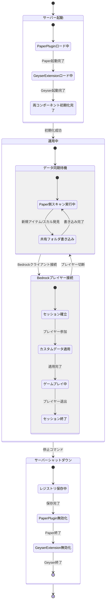
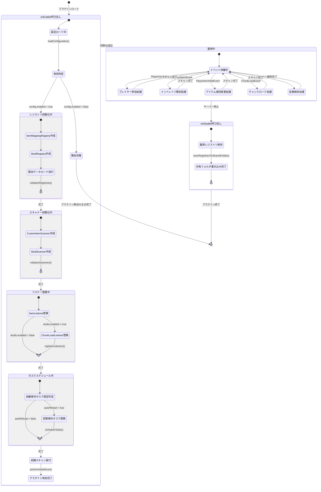
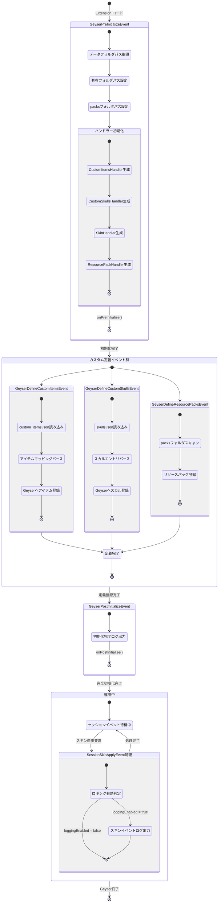
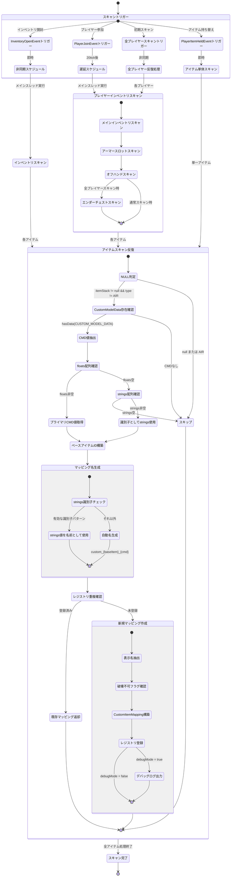
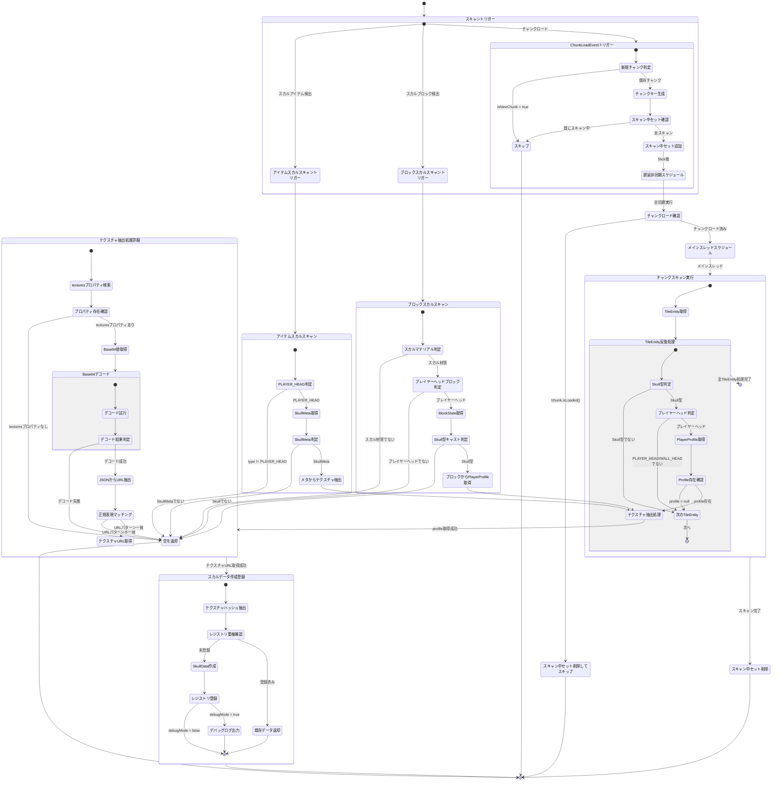
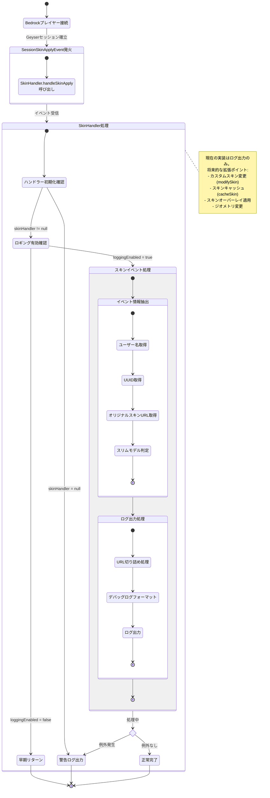

# GeyserExtra Extension ステートマシン図

このドキュメントは、GeyserExtra Extension システム全体の状態遷移をMermaid形式で記述します。

## 1. 全体システムステートマシン - Paper Plugin と Geyser Extension の連携

## 2. Paper Plugin ライフサイクル - 起動から終了まで

## 3. Geyser Extension ライフサイクル - 起動から終了まで

## 4. Custom Item スキャンプロセス - アイテム検出から登録まで

## 5. Skull スキャンプロセス - スカル検出から登録まで

## 6. スキン同期プロセス - Bedrock プレイヤーのスキン適用

## 7. 共有フォルダを介したデータフロー

```mermaid
stateDiagram-v2
    [*] --> Paper側処理

    state Paper側処理 {
        [*] --> アイテム/スカル発見

        state アイテム/スカル発見 {
            [*] --> CustomItemScanner実行
            [*] --> SkullScanner実行
            CustomItemScanner実行 --> ItemMappingRegistry更新
            SkullScanner実行 --> SkullRegistry更新
        }

        ItemMappingRegistry更新 --> 共有フォルダ保存トリガー
        SkullRegistry更新 --> 共有フォルダ保存トリガー

        state 共有フォルダ保存トリガー {
            [*] --> 定期タイマー発火: autoReload有効時
            [*] --> サーバー停止時: onDisable
            [*] --> 手動トリガー: 将来実装
        }

        共有フォルダ保存トリガー --> レジストリ保存処理

        state レジストリ保存処理 {
            [*] --> 共有フォルダ存在確認
            共有フォルダ存在確認 --> ディレクトリ作成: 存在しない
            共有フォルダ存在確認 --> custom_items.json書き込み: 存在する
            ディレクトリ作成 --> custom_items.json書き込み

            custom_items.json書き込み --> skulls.json書き込み: customItems.enabled
            custom_items.json書き込み --> skulls.json書き込み判定: customItems.disabled

            state skulls.json書き込み判定 <<choice>>
            skulls.json書き込み判定 --> skulls.json書き込み: skulls.enabled
            skulls.json書き込み判定 --> [*]: skulls.disabled

            skulls.json書き込み --> [*]
        }
    }

    Paper側処理 --> 共有フォルダ: JSON保存

    state 共有フォルダ {
        [*] --> ファイル状態

        state ファイル状態 {
            custom_items.json: カスタムアイテム定義
            skulls.json: スカルテクスチャ定義
        }
    }

    共有フォルダ --> Geyser側処理: 起動時読み込み

    state Geyser側処理 {
        [*] --> ハンドラー初期化時

        state ハンドラー初期化時 {
            [*] --> CustomItemsHandler
            [*] --> CustomSkullsHandler

            state CustomItemsHandler {
                [*] --> custom_items.json存在確認

                state custom_items.json存在確認 <<choice>>
                custom_items.json存在確認 --> サンプルファイル作成: 存在しない
                custom_items.json存在確認 --> JSONパース: 存在する

                JSONパース --> アイテムマッピング構築
                アイテムマッピング構築 --> メモリ保持
            }

            state CustomSkullsHandler {
                [*] --> skulls.json存在確認

                state skulls.json存在確認 <<choice>>
                skulls.json存在確認 --> サンプルファイル作成: 存在しない
                skulls.json存在確認 --> JSONパース: 存在する

                JSONパース --> スカルエントリ構築
                スカルエントリ構築 --> メモリ保持
            }
        }

        ハンドラー初期化時 --> Geyserイベント登録時

        state Geyserイベント登録時 {
            [*] --> GeyserDefineCustomItemsEvent
            [*] --> GeyserDefineCustomSkullsEvent

            GeyserDefineCustomItemsEvent --> カスタムアイテムをGeyserに登録
            GeyserDefineCustomSkullsEvent --> カスタムスカルをGeyserに登録
        }
    }

    Geyser側処理 --> Bedrockプレイヤーに反映: カスタムコンテンツ配信
    Bedrockプレイヤーに反映 --> [*]
```

---

## ステートマシン図の解説

### 1. 全体システムステートマシン
Paper PluginとGeyser Extensionの連携を示しています。サーバー起動時にPaperが先に初期化され、その後Geyserが起動します。運用中はデータ同期とBedrockプレイヤーの接続処理が並行して行われます。

### 2. Paper Plugin ライフサイクル
`onEnable`から`onDisable`までの完全なライフサイクルを示しています。設定ロード、レジストリ初期化、スキャナー初期化、リスナー登録、タスクスケジュールの順序で初期化が行われます。

### 3. Geyser Extension ライフサイクル
`GeyserPreInitializeEvent`から運用開始までの流れを示しています。各ハンドラーの初期化とカスタムコンテンツの定義イベント処理が含まれます。

### 4. Custom Item スキャンプロセス
各種イベント（プレイヤー参加、インベントリ開封、アイテム持ち替え）からCustomModelDataを持つアイテムを検出し、レジストリに登録するまでの詳細な流れを示しています。

### 5. Skull スキャンプロセス
チャンクロードイベントやブロック/アイテムスキャンから、PlayerProfileのテクスチャデータを抽出してレジストリに登録するまでの流れを示しています。

### 6. スキン同期プロセス
Bedrockプレイヤーのスキン適用イベント処理を示しています。現在はログ出力のみですが、将来の拡張ポイントも記載しています。

### 7. 共有フォルダを介したデータフロー
Paper PluginとGeyser Extension間でのデータ同期の仕組みを示しています。Paper側がJSONファイルを生成し、Geyser側が起動時に読み込む一方向のデータフローとなっています。
